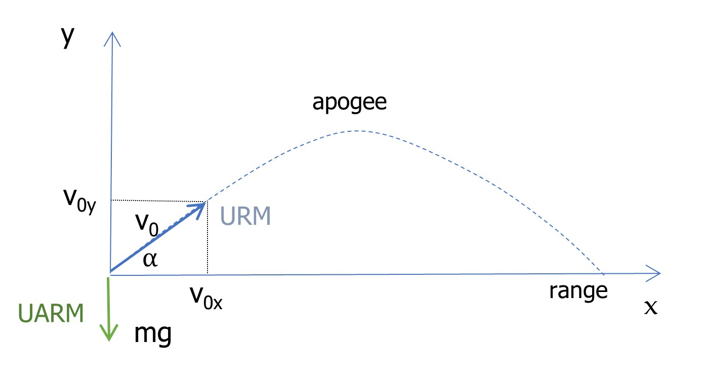
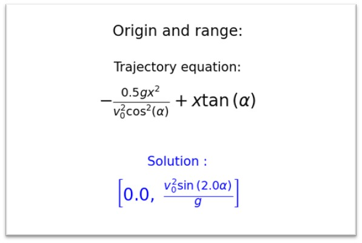
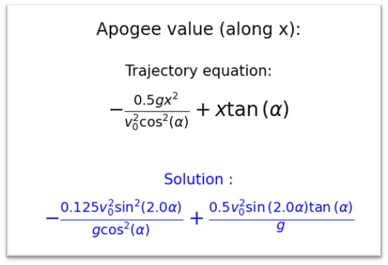
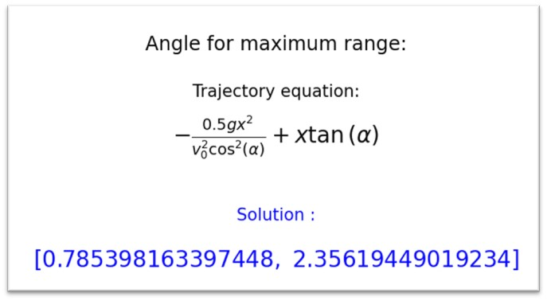

## Use python and math to solve physics problems.

We will illustrate here how Python symbolic module sympy can be used to solve a ballistic problem.

See [ballistic.py](ballistic.py) for the code.

