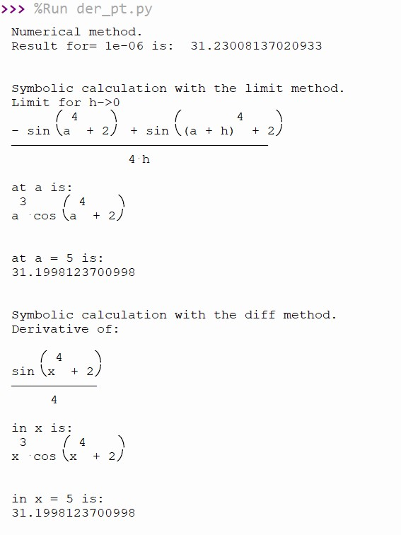

## Differnt ways to calculate derivates at a point.

In the [der_pt.py](der_pt.py) program we use several methods to calculate the derivative of a funtion at a point:

- Numerical approximation of the limit from the formula of the derivative.
- Symbolic calculation of the limit from the formula of the derivative and evaluation at a given point.
- Symbolic calculation of the derivative and evaluation at a given point.

Th result are the following:

