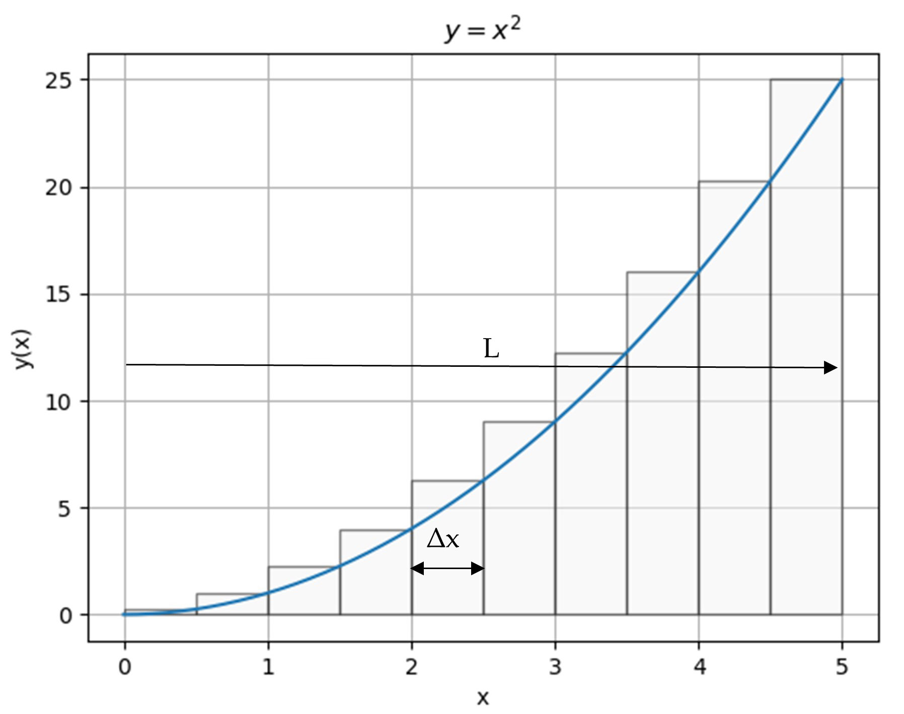

## Integrals and antiderivatives.

### Integrals: numerical approach.

The integral of the function can be described as the area under the function between 2 abscissas.

In this diagram we see that the area is the sum of the rectangles when their widths approaches 0. 

The integral exists if the limit exists.

Python code for a parabola:  [num_int_para.py](num_int_para.py)

### Integrals: symbolic approach.

See this example: [sym_int_para.py](sym_int_para.py)

### Antiderivatives and fundamental theorem.

The antiderivative of f(x) is the function F(x) such as $\displaystyle\left(\frac{dF(x)}{dx}\right)=f(x)$

The fundamental theorem of calculus states that the integral of a function between  a and b is equal to the varaition of the antiderivatives between a and b (= F(b)-F(a))

Symbolic computation of antiderivative : [antder_sympy.py](antder_sympy.py)
