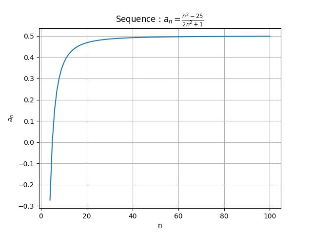
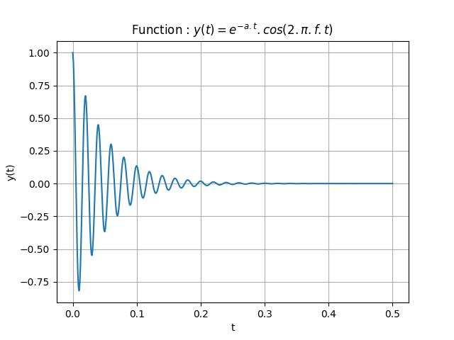

### Numerical approach.

The first method we can use is to look at the graph to get an idea of how the sequence or function behaves when they approach the limit. 

Here is the result for the sequence and the function we already have described. The limit of interest is infinity.

*The num_sequence.py (see plotting a graph) is used here, slightly modified in adding a low boundary (4 in the example).*

*The num_funcR.py (see plotting a graph) is used for this plot.*

We can see that the first one seems to converge toward **0.5** and the second one toward **0** (a = 20, f = 50).

Another method consists in listing the values of the sequence or function when we tend to the limit. It means, in our two examples, that the variable gets bigger and bigger.

The following code is used for the sequence : [num_limit.py](num_limit.py) and gives :

Limit approximation from 100 to 10000, step = 500

Limit = 0.4987250637\
Limit = 0.4999645834\
Limit = 0.4999894628\
Limit = 0.4999950195\
Limit = 0.4999971088\
Limit = 0.4999981139\
Limit = 0.4999986733\
Limit = 0.4999990162\
Limit = 0.4999992415\
Limit = 0.4999993974\
Limit = 0.4999995098\
Limit = 0.4999995934\
Limit = 0.4999996574\
Limit = 0.4999997073\
Limit = 0.4999997471\
Limit = 0.4999997793\
Limit = 0.4999998057\
Limit = 0.4999998276\
Limit = 0.4999998460\
Limit = 0.4999998617

Both methods are simple approach to "see" how the function behave near a given value. But you must be careful in using this metho, especially when the function is not defined everywhere...

A more reliable method consists in a symbolic processing of the function at the limit. It could be done by hand or using a symbolic module like **`sympy`**.
