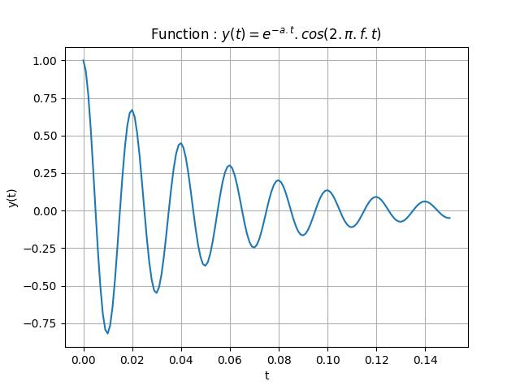

## Doing graphs with pyplot and using numpy to describe real-valued functions.

A function is described as a list of coordinates stored into vectors.

As in the *num_sequence.py* program, the Python code is made of 5 parts :

- Module import.

  **`numpy`** and **`pyplot`** are imported.
   
- Function and variables declaration.

  **`def my_function(n):`** this function will be called to compute each element of the function.
  Several variables are declared and initialised. 
  
  Unlike in the *num_sequence.py* code the abscissa are not natural numbers but real values ranging between two boundaries. The range is **`disp_range = high_bnd-low_bnd`**.
  
  The number of elements for abscissa is calculated from the range and the choosen increment between values **`delta`**. This number is **`niter = int(disp_range/delta)+1`**.  
  
- Vectors allocation.

  Use the **`zeros`** function from **`numpy`** to allocate vectors filled by 0.

- Filling of the vector with abscissa and corresponding ordinate values.

  Two **`for`** loops are used to fill the vectors. The first one, for the abscissa, computes the value by adding delta to the previous abscissa. So it's necessary to initialise the first element outside of the loop and to start the loop with the element of index 1.

- Plotting initialisation and display.

  Plot the graph in memory, then add some "ornaments", then display it on the screen.
Here is the program : [num_funcR.py](num_funcR.py)

And the result for a = 20 and f = 50 :

