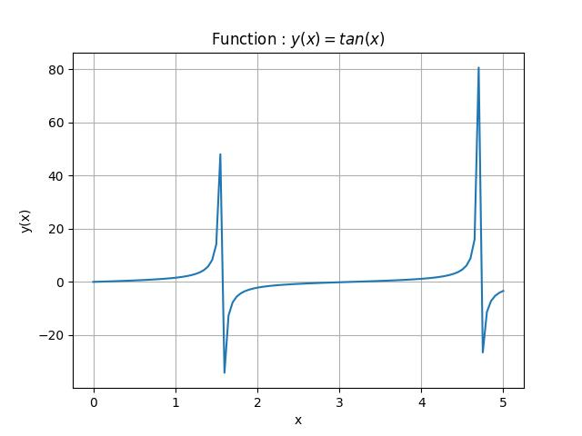

## Pitfall.

The function plotting program, however simple it is, will not work, or give incorrect result if the function is not defined somewhere on the range used to plot it.

For instance if we take the tan(x) function, this function is not defined for x = (2k+1) $\pi\over2$

If we plot the fonction ([see code](num_funcRtg.py)) on a range including these singularities we obtain :

The range here is 0 to 5 including $\pi\over2$ and $3\pi\over2$ where the function is not defined and where the graph is incorrect or worst where the program can crash.

**`Important rule`** : always search for singularities before writing your code and take measure to avoid problems.
