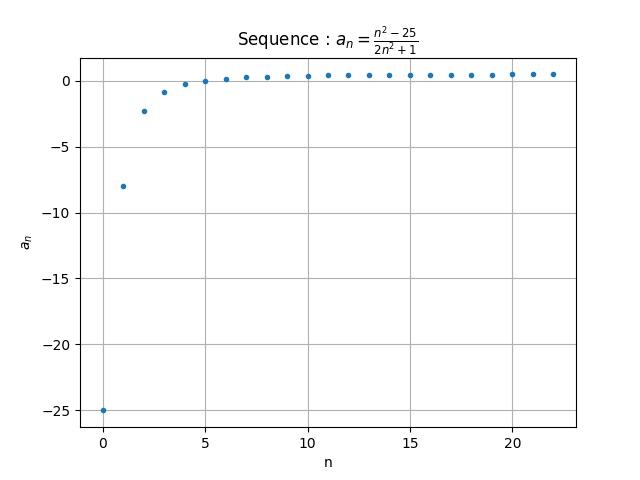

## Doing graphs with pyplot and using numpy to create sequences.
The first example is a simple program that walks through how to create a sequence of values and display it graphically.

The index of the sequence is a natural number.

Here is the program : [num_sequence.py](num_sequence.py)

The Python code is made of 5 parts :

- Module import.

**`numpy`** and **`pyplot`** are imported

- Function and variables declaration.

**`def my_function(n):`** this function will be called to comput each element of the sequence

- Vectors allocation.

Use the **`zeros` function from **`numpy`** to allocate vectors filled by 0.

- Filling of the vector with abscissa and corresponding ordinate values.

Two **`for`** loops are used to fill the vectors.

- Plotting initialisation and display.

Plot the graph in memory, then add some "ornaments", the display it on the screen.

The resulting display is :

